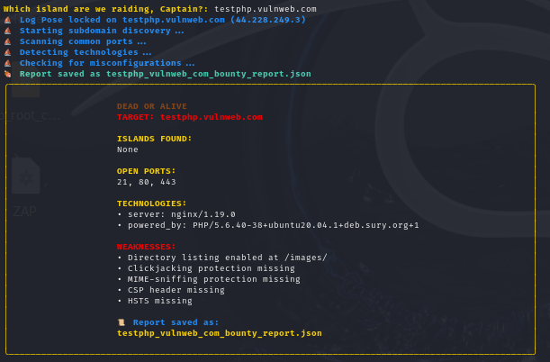
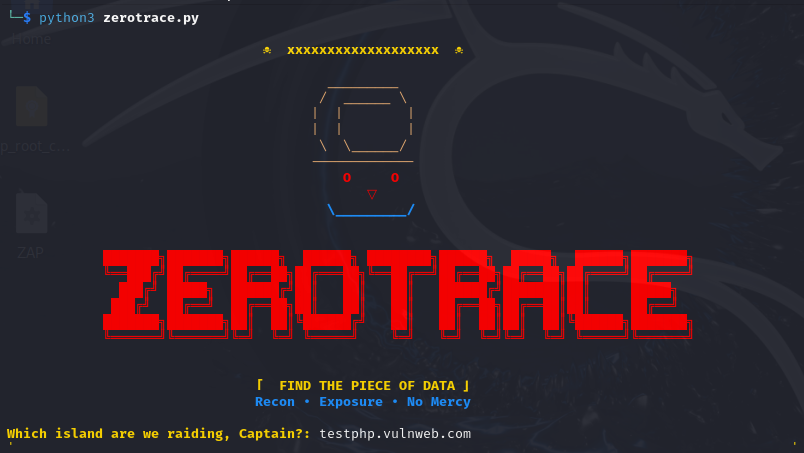
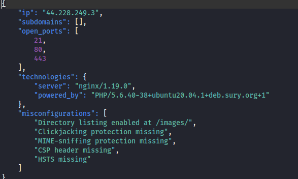

# 🏴‍☠️ ZEROTRACE
**Find The Piece of Data: Recon • Exposure • No Mercy**

ZEROTRACE is a lightweight, high-speed reconnaissance tool designed with a **One Piece** aesthetic. It helps security researchers "raid" a target domain to find subdomains, open ports and common web misconfigurations.

---

## 📸 Interface
<p align="center">
  
  
  <br>
  <i>The Pirate King's Recon Tool in Action</i>
</p>


---

## ⚓ Features
*   **⛵ Log Pose:** High-speed subdomain discovery.
*   **⚔️ Port Scan:** Identifies open gates (Common ports: 80, 443, 22, etc.).
*   **🍖 Tech Intel:** Detects Server headers and "Powered-By" info.
*   **🏴‍☠️ Weakness Audit:** Checks for Directory Listing, Missing Security Headers (CSP, HSTS) and CORS flaws.
*   **📜 Bounty Report:** Generates a JSON report of all findings.

---

## 🛠️ Setup & Installation

### 1. Clone the ship
```bash
git clone https://github.com/rambutdurian/ZEROTRACE.git
cd ZEROTRACE
```

### 2. Install dependencies
```bash
pip install -r requirements.txt
```

## 🚀 Usage
Run the script and follow the prompt:
```bash
python zerotrace.py
```

##📜 Bounty Report Example
Reports are saved as testphp_vulnweb_com_bountyreport.json
<p align="center">
  
  <br>
  <i>The Bounty Report</i>
</p>

### ⚠️ Disclaimer
This tool is for educational purposes only. Do not use it on targets without explicit permission.
